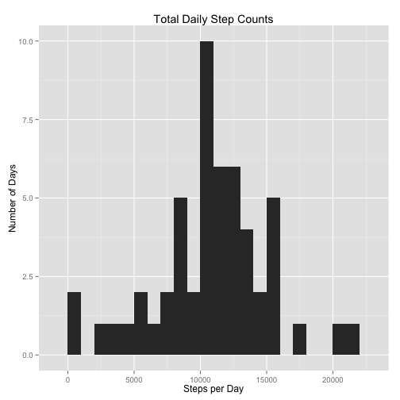
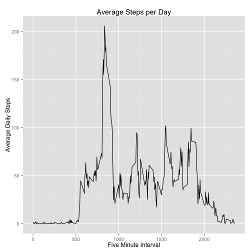
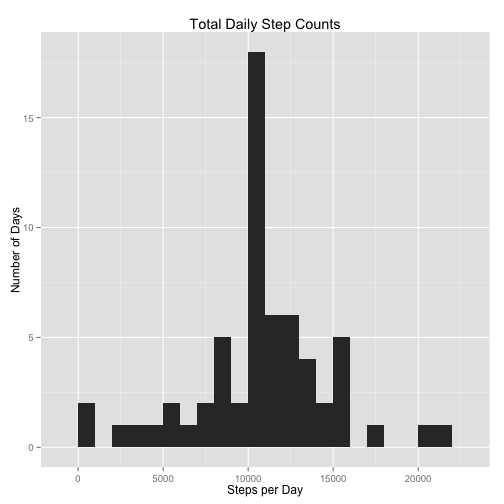
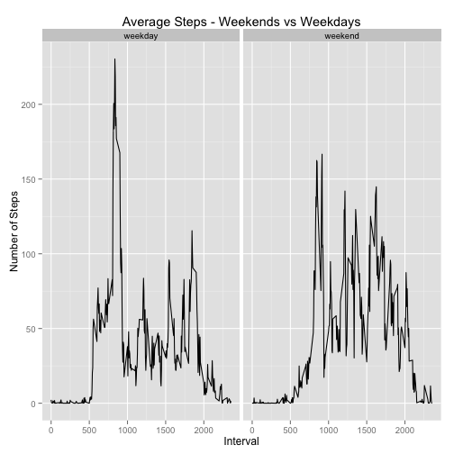

## Introduction
An investigation of the step-count data recorded over the two month period, from October to November 2012. The step count data is recorded as the number of steps taken in five minute intervals throughout each day.

The dataset consists of three variables:

1. steps: the number of steps taken in a five-minute interval
2. data: the date the measurement was taken
3. interval: identifier of the five-minute interval in which the measureent was taken

## Loading and preprocessing the data

```r
# Specify required libraries and define functions.
library(ggplot2)
weekdayOrWeekend <- function(aDate) {
    dayName <- weekdays(as.Date(aDate))
    if (dayName %in% c("Monday", "Tuesday", "Wednesday", "Thursday", "Friday")) {
        x <- "weekday"
    }
    else if (dayName %in% c("Saturday", "Sunday")) {
            x <- "weekend"
    }
    else {
        x <- "Invalid date"
    }
    x
}
```

Read the step count data and format the date column values as dates.


```r
# Assume that the compressed data file exists in the current directory.
data <- read.csv(unzip("activity.zip"))
data$date <- as.Date(data$date, format="%Y-%m-%d")
```

## What is mean total number of steps taken per day?

```r
totalSteps <- aggregate(x=list(steps=data$steps), by=list(date=data$date), sum)
```


```r
ggplot(totalSteps, aes(steps)) + geom_histogram(binwidth=1000) + ggtitle("Total Daily Step Counts") + xlab("Steps per Day") + ylab("Number of Days")
```

 

```r
originalMean <- as.integer(mean(totalSteps$steps, na.rm=TRUE))
originalMedian <- as.integer(median(totalSteps$steps, na.rm=TRUE))
```

The mean number of total taken per day is 10766 and the median is 10765.

## What is the average daily activity pattern?

```r
averageSteps <- aggregate(x=list(steps=data$steps), by=list(interval=data$interval), mean, na.rm=TRUE)
ggplot(averageSteps, aes(x=interval, y=steps)) + geom_line() + ggtitle("Average Steps per Day") + xlab("Five Minute Interval") + ylab("Average Daily Steps")
```

 


```r
# Find the number of the row that contains the largest average steps.
# http://stackoverflow.com/questions/6025051/extracting-indices-for-data-frame-rows-that-have-max-value-for-named-field
a <- averageSteps[which.max(averageSteps$steps), ]
maxInterval <- a$interval
```

The index of the row which contains the largest average number of steps is 835.

## Imputing missing values
Use *mean imputation* to replace the NAs with the daily mean of the corresponding interval. For each row
that contains an NA for the step count, find the corresponding interval in the averageSteps data frame,
then replace the missing step count with the mean step count for that interval.

A quick check of the data shows that only the "steps"" column contains NA.


```r
# How many rows have missing values?
numNAs <- length(which(is.na(data$steps)))
```

The number of rows that have missing values (NA) for the steps count is 2304.


```r
# Make a copy of the original data frame, then replace any NAs in the rows with the average number of steps
# for the corresponding interval. Then aggragate, plot, and report mean/meaian.
newDF <- data
for (row in 1:nrow(newDF)) {
    if (is.na(newDF[row,]$steps)) {
        newDF[row,]$steps <- averageSteps[which(newDF[row,]$interval == averageSteps$interval),]$steps
    }
}
totalSteps <- aggregate(x=list(steps=newDF$steps), by=list(date=newDF$date), sum)

ggplot(totalSteps, aes(steps)) + geom_histogram(binwidth=1000) + ggtitle("Total Daily Step Counts") + xlab("Steps per Day") + ylab("Number of Days")
```

 

```r
newMean <- as.integer(mean(totalSteps$steps, na.rm=TRUE))
newMedian <- as.integer(median(totalSteps$steps, na.rm=TRUE))
```

After replacing NAs with the mean of the corresponding interval, the mean number of total taken per day is 10766 and the median is 10766.

As would be expected, the mean and median do not change (well, the median has increased by one, but this is not significant). Where we do see a difference is in the basic shape of the histogram. Overall, the histograms of the original data and the imputed data are roughly the same but the height of the bar representing the bin containing the mean/median has shown a significant increase in height. As the NAs have been replaced by the mean values, this change makes sense as there are now more occurances of  this value.

## Are there differences in activity patterns between weekdays and weekends?

```r
newDF$dayType <- sapply(newDF$date, FUN=weekdayOrWeekend)
newDF$dayType <- as.factor(newDF$dayType)
```


```r
averageSteps <- aggregate(data=newDF, steps~interval + dayType, mean)

ggplot(data=averageSteps, aes(x=interval, y=steps, group=dayType)) + 
  geom_line() + facet_wrap(~ dayType, nrow=1, ncol=2) + ggtitle("Average Steps - Weekends vs Weekdays") +
    xlab("Interval") + ylab("Number of Steps")
```

 

From the final graphs, we see that, despite the spike in the weekday data, the weekend activity pattern is generally greater than that seen on weekdays.
